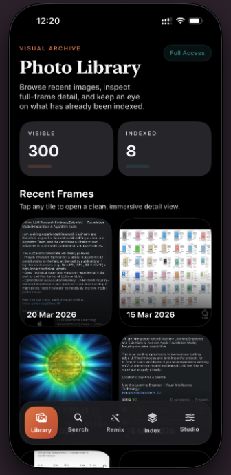
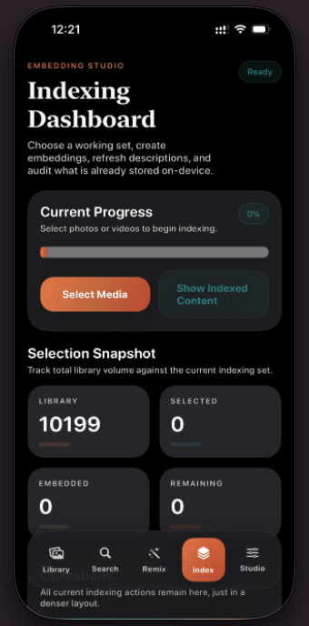
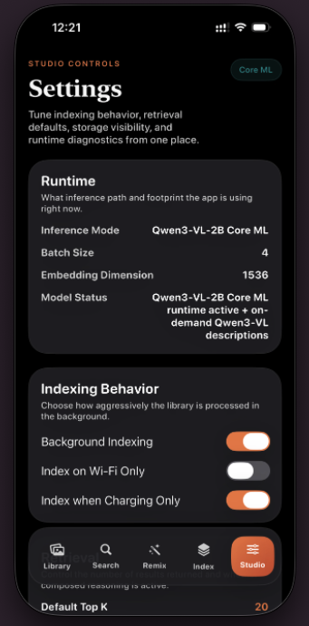
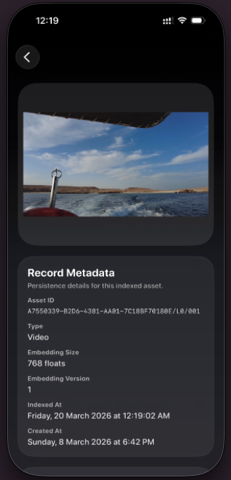
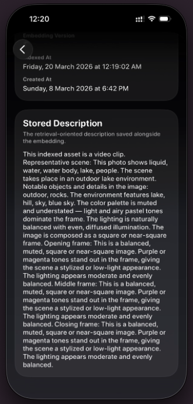
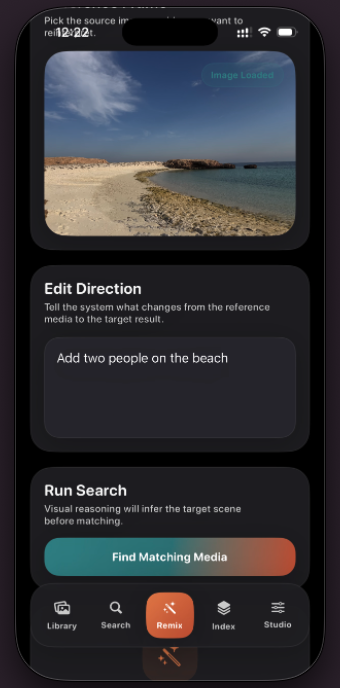

# VisQ (VisualQuery iOS)

<p align="center">
  
</p>

> Intelligent on-device photo and video retrieval for iPhone, based on CoVR-R and powered by a bundled Qwen3-VL-2B Core ML runtime.

[](https://developer.apple.com/ios/)
[](https://swift.org)
[](https://developer.apple.com/documentation/coreml)
[](https://huggingface.co/Qwen)

## 📱 App Preview

<p align="center">
  
  
  
</p>
<p align="center">
  
  
  
</p>

## ✨ At A Glance

<table>
  <tr>
    <td align="center" width="25%"><strong>🧠 On-Device AI</strong><br/>Qwen3-VL-2B Core ML runtime for local retrieval.</td>
    <td align="center" width="25%"><strong>🔎 Smart Search</strong><br/>Text search plus composed retrieval with a reference image.</td>
    <td align="center" width="25%"><strong>💡 Explainable Results</strong><br/>"Why This Matched" chips and detail-view reasoning.</td>
    <td align="center" width="25%"><strong>🔒 Privacy-First</strong><br/>Embeddings, ranking, and inference stay on device.</td>
  </tr>
</table>

## ✨ Overview

**VisQ** is the user-facing iPhone app name. The codebase and Xcode target remain named **VisualSeek**.

This app is based on **CoVR-R: Reason-Aware Composed Video Retrieval**, adapting the paper's reason-aware composed retrieval ideas into an on-device iPhone experience. VisQ brings that research direction into a local-first mobile product with reference-image retrieval, text-guided scene modification, and explainable match results.

The app brings reason-aware visual retrieval to iPhone with a privacy-first design:

- Index photos and videos from the local photo library
- Search with natural language
- Run composed retrieval with a reference image plus an edit prompt
- Show "Why This Matched" explanations on retrieved results
- Keep embeddings, ranking, and inference on-device

The current production path prefers bundled Core ML models at startup, using `QwenVisionEncoder` and `QwenTextFusion` to back the Qwen3-VL-2B runtime. If the bundled models are unavailable, the app can fall back to lighter local adapters so development is still possible.

## 🔎 What The App Does

### 1. Library Indexing

VisQ scans the user's photo library with `PhotoKit`, preprocesses media, generates embeddings, and stores them locally in SQLite-backed storage for fast retrieval.

### 2. Text Retrieval

The user enters a natural-language query such as:

- `sunset over the beach`
- `warm indoor portrait`
- `night city with reflections`

The app turns the query into retrieval guidance, compares it against indexed embeddings, and returns the closest matches with scores and explanation chips.

### 3. Composed Retrieval

The user selects a reference image and adds an edit instruction such as:

- `same scene but at night`
- `make it warmer and more cinematic`
- `similar pose on a beach`

VisQ combines the reference image signal with text guidance, generates a reasoned target representation, and retrieves visually related results from the indexed library.

### 4. Explainability Layer

After results appear, the app surfaces a "Why This Matched" layer with:

- visual chips such as `warm light`, `beach`, `silhouette`, `night mood`
- human-readable match reasons such as `matched because of pose`, `color`, or `scene`
- a detail-view explanation panel when the user opens a result

### 5. Local-First Privacy

Media, embeddings, retrieval logic, and runtime inference all stay on device. The app does not require a server round-trip to index or search your library.

## 🌟 Feature Highlights

| Feature | Description |
|---|---|
| Photo and Video Indexing | Creates local embeddings for photo-library assets |
| Text Search | Natural-language retrieval over indexed media |
| Composed Retrieval | Reference image + text modification retrieval flow |
| Why This Matched | Explanation chips and detail-view reasoning |
| Detail Viewer | Opens the selected media with score and explanation context |
| On-Device Runtime | Bundled Core ML runtime for Qwen3-VL-2B path |
| Offline-First | Retrieval still works without network access |

## 🏗️ System Architecture

### High-Level System Design

```text
┌─────────────────────────────────────────────────────────────────┐
│                           VisQ iOS App                          │
│                                                                 │
│  ┌──────────────┐   ┌──────────────┐   ┌──────────────────┐     │
│  │  Photo/Video │   │   Indexing   │   │    Retrieval     │     │
│  │   Picker UI  │──▶│   Pipeline   │──▶│     Engine       │     │
│  └──────────────┘   └──────┬───────┘   └────────┬─────────┘     │
│                            │                    │               │
│                   ┌────────▼────────┐  ┌────────▼──────────┐    │
│                   │  Qwen3-VL-2B    │  │  Vector Index     │    │
│                   │  Vision Runtime │  │  On-device SQLite │    │
│                   │  (Core ML)      │  │  + similarity     │    │
│                   └─────────────────┘  └───────────────────┘    │
│                                                                 │
│  ┌──────────────────────────────────────────────────────────┐   │
│  │              Composed Retrieval Module                   │   │
│  │                                                          │   │
│  │  Reference Image  +  Text Edit                           │   │
│  │        │                  │                              │   │
│  │        ▼                  ▼                              │   │
│  │  Visual Embedding   Text + Vision Reasoning              │   │
│  │        │            + explanation generation             │   │
│  │        └──────────┬─────────────────                     │   │
│  │                   ▼                                      │   │
│  │         Importance-Weighted Fusion                       │   │
│  │                   │                                      │   │
│  │                   ▼                                      │   │
│  │         Cosine Similarity Search                         │   │
│  └──────────────────────────────────────────────────────────┘   │
└─────────────────────────────────────────────────────────────────┘
```

### Model Architecture

The app uses a bundled Core ML runtime built around the Qwen3-VL-2B retrieval path:

```text
Input Image / Video Frame
          │
          ▼
┌─────────────────────────────────┐
│  Qwen Vision Encoder Runtime    │
│  ┌───────────────────────────┐  │
│  │  Image preprocessing      │  │
│  │  patch / token encoding   │  │
│  └──────────┬────────────────┘  │
│             │                   │
│  ┌──────────▼────────────────┐  │
│  │  Vision transformer stack │  │
│  │  Core ML execution path   │  │
│  └──────────┬────────────────┘  │
│             │                   │
│  ┌──────────▼────────────────┐  │
│  │ Importance-weighted       │  │
│  │ pooling + normalization   │  │
│  └──────────┬────────────────┘  │
└─────────────┼───────────────────┘
              │
              ▼
      1536-dim visual embedding
```

For composed retrieval, the app combines the reference-image embedding with text guidance and generates a reasoned target representation before running vector search. That is also where the "Why This Matched" explanation layer is assembled for result cards and the detail screen.

## 🗂️ Project Structure

```text
VisualSeek/
├── VisualSeek.xcodeproj
├── VisualSeek-Info.plist
├── VisualSeek/
│   ├── App/
│   ├── Assets.xcassets/
│   ├── CoreML/
│   ├── Indexing/
│   ├── Models/
│   ├── Resources/
│   ├── Retrieval/
│   ├── Utilities/
│   └── Views/
├── VisualSeekTests/
└── VisualSeekUITests/
```

## ✅ Requirements

- macOS 14 or newer
- Xcode 16 or newer
- iOS 17 or newer
- A valid Apple Developer signing identity for physical-device deployment
- Git LFS for the bundled Core ML weight files
- Enough local disk space for model assets and DerivedData

Recommended for the best real-device experience:

- iPhone with A14 or newer
- Full Photo Library access on first launch
- Device connected to power for larger indexing runs

## 🚀 Setup

### 1. Clone The Repository

```bash
git clone https://github.com/OmkarThawakar/VisQ.git
cd VisQ
```

### 2. Install Git LFS

The Core ML packages are large, so Git LFS must be installed before the first build.

```bash
git lfs install
git lfs pull
```

If you skip this step, the app may build with placeholder pointer files instead of real model weights.

### 3. Open The Project In Xcode

From the repository root:

```bash
open VisualSeek.xcodeproj
```

### 4. Confirm Signing

In Xcode:

1. Select the `VisualSeek` project.
2. Select the `VisualSeek` app target.
3. Open `Signing & Capabilities`.
4. Choose your development team.
5. If needed, change the bundle identifier from `omkar.VisualSeek` to one that is unique for your Apple ID.

### 5. Verify Model Assets

Before running, make sure these bundled packages exist under `VisualSeek/CoreML/`:

- `QwenVisionEncoder.mlpackage`
- `QwenTextFusion.mlpackage`

The repo may also contain optional Qwen2VL generation assets:

- `Qwen2VLVisionEncoder.mlpackage`
- `Qwen2VLPrefill.mlpackage`
- `Qwen2VLDecodeStep.mlpackage`

These optional assets support richer generation and description flows when available, but the main retrieval runtime is the bundled Qwen3-VL-2B Core ML path.

## 🛠️ Core ML Model Conversion

<details>
<summary><strong>Expand model export and conversion steps</strong></summary>

If you already pulled the bundled `.mlpackage` files through Git LFS, you can skip this section. These steps are only needed when you want to regenerate the Core ML assets from source.

### 1. Install Python Dependencies

From the repository root:

```bash
cd ModelConversion
python3 -m venv .venv
source .venv/bin/activate
pip install -r requirements.txt
```

### 2. Export The Qwen3-VL Vision Tower

This exports the vision side of `Qwen/Qwen3-VL-2B-Instruct` to TorchScript for the current iOS retrieval pipeline.

```bash
python export_qwen3_vl_vision.py \
  --model_id Qwen/Qwen3-VL-2B-Instruct \
  --output_dir ./real_exports \
  --input_resolution 448 \
  --output_dim 1536
```

Expected output:

- `ModelConversion/real_exports/qwen3_vl_vision_encoder.pt`

### 3. Export The Text Fusion Encoder

This produces the pooled text-side fusion representation used by the current retrieval runtime.

```bash
python export_qwen3_vl_text_fusion.py \
  --model_id Qwen/Qwen3-VL-2B-Instruct \
  --output_dir ./real_exports \
  --output_dim 1536 \
  --max_tokens 32
```

Expected output:

- `ModelConversion/real_exports/qwen3_vl_text_fusion.pt`

### 4. Convert TorchScript To Core ML

Convert the exported TorchScript files into the Core ML packages used by the app:

```bash
python convert_to_coreml.py \
  --torchscript_path ./real_exports/qwen3_vl_vision_encoder.pt \
  --output_path ../VisualSeek/VisualSeek/VisualSeek/CoreML/QwenVisionEncoder.mlpackage \
  --compute_units ALL \
  --input_resolution 448 \
  --embedding_dim 1536
```

```bash
python convert_to_coreml.py \
  --mode text_fusion \
  --torchscript_path ./real_exports/qwen3_vl_text_fusion.pt \
  --output_path ../VisualSeek/VisualSeek/VisualSeek/CoreML/QwenTextFusion.mlpackage \
  --compute_units ALL \
  --embedding_dim 1536
```

### 5. Optional Sanity Check

You can do a quick load test on the generated vision package:

```bash
python validate_coreml.py \
  --model_path ../VisualSeek/VisualSeek/VisualSeek/CoreML/QwenVisionEncoder.mlpackage \
  --input_resolution 448 \
  --embedding_dim 1536
```

### Notes

- The first export may take time because the Hugging Face weights need to be downloaded into the local cache.
- The current Qwen3-VL conversion path in this repo is based on TorchScript export plus `coremltools` conversion.
- The generated Core ML packages should replace the runtime assets loaded by `ModelLoader` at app startup.

</details>

## 📲 Running In Xcode

### Simulator

1. Choose the `VisualSeek` scheme.
2. Select an iPhone simulator.
3. Press `Cmd+R`.

Notes:

- Simulator builds are useful for UI work and general debugging.
- Simulator performance is not representative of real-device inference.
- The best runtime path is validated on physical hardware, not simulator-only execution.

### Physical iPhone

1. Connect your iPhone to your Mac.
2. Unlock the device and trust the computer if prompted.
3. Enable Developer Mode on the phone if iOS asks for it.
4. In Xcode, select your iPhone as the run destination.
5. Build and run with `Cmd+R`.

On first launch:

1. Grant Photo Library access.
2. Prefer **Full Access** if you want to index the full library.
3. Wait for the runtime to finish loading.
4. Start indexing from the app.

For the smoothest first run on iPhone:

- keep the device unlocked during the first model load
- stay on power if you are indexing a large library
- expect the first run to take longer while models are loaded and caches warm up

## 🧭 How To Use The App

### Index Your Library

Open the indexing flow and start processing photos and videos from your library. Indexed records are stored locally and reused across launches.

### Run A Text Search

Open search, type a natural-language query, and review the ranked results grid. Each result shows a score and explanation cues.

### Run Composed Retrieval

Choose a reference image, enter a modification prompt, and run retrieval. The app combines the reference image with textual guidance to find the closest matching targets.

### Inspect A Result

Tap any result to open the media detail view. The detail screen shows the selected asset along with the explanation layer that describes why it matched.

## 🧠 Current Runtime Behavior

The app currently prefers the bundled Core ML runtime on startup:

- `ModelLoader` loads `QwenVisionEncoder` and `QwenTextFusion`
- `AppState` wires the loaded runtime into indexing and retrieval
- settings and diagnostics indicate whether bundled models are active

If the bundled models cannot load, the app falls back to lightweight local adapters so the app still launches. That fallback is primarily intended for resilience and development, not for the ideal production experience.

## 💾 Storage And Retrieval Notes

- Embeddings are stored locally in SQLite-backed storage
- vector search is performed on-device
- cached embeddings may be cleared automatically if the stored embedding format no longer matches the current runtime
- photo-library permission is required for indexing and retrieval over user assets

## 🧪 Testing And Validation

Build from the repository root:

```bash
xcodebuild -project VisualSeek.xcodeproj -scheme VisualSeek -configuration Debug -sdk iphonesimulator build CODE_SIGNING_ALLOWED=NO
```

Run tests:

```bash
xcodebuild test -project VisualSeek.xcodeproj -scheme VisualSeek -destination 'platform=iOS Simulator,name=iPhone 17'
```

The repository includes:

- unit tests in `VisualSeekTests/`
- UI tests in `VisualSeekUITests/`
- production-readiness checks for key runtime assumptions

## 🩺 Troubleshooting

<details>
<summary><strong>Expand troubleshooting guide</strong></summary>

### The App Builds But Models Do Not Load

- confirm `git lfs pull` completed successfully
- confirm the Core ML packages exist under `VisualSeek/CoreML/`
- check that the large `weight.bin` files are real assets, not Git LFS text pointers

### Xcode Signing Fails

- select a valid Apple development team
- change the bundle identifier if another app already uses `omkar.VisualSeek`
- reconnect the phone and re-trust the computer if deployment is blocked

### The App Launches But Search Is Empty

- make sure Photo Library access was granted
- run indexing first
- verify the indexing flow finishes and embeddings are present

### Real-Device Performance Seems Slow

- the first load is slower than subsequent runs
- simulator is much slower than iPhone hardware
- larger libraries naturally take longer to index

</details>

## 🔒 Privacy

VisQ is designed as a local-first retrieval app:

- user media is read from `PhotoKit`
- embeddings are stored on device
- inference runs locally through Core ML
- the app does not require cloud inference to retrieve results

## 📚 Research Context

The original paper focuses on reason-aware composed retrieval, where a system first builds an intermediate understanding of how a target scene should change and then retrieves the closest match. VisQ brings that same general approach into a local-first mobile app with:

- reference image/video plus text modification retrieval
- reasoning-guided target representation
- explanation-aware result presentation through the "Why This Matched" layer

## 🛣️ Roadmap

- improve production hardening for background indexing
- expand diagnostics and test coverage
- improve real-device retrieval explainability
- continue tuning bundled on-device model performance

## 📖 Citation

If you use or reference the research basis for this app, please cite **CoVR-R: Reason-Aware Composed Video Retrieval**.

```bibtex
@inproceedings{thawakar2026covrr,
  title = {CoVR-R: Reason-Aware Composed Video Retrieval},
  author = {Thawakar, Omkar and
               Demidov, Dmitry and
               Potlapalli, Vaishnav and
               Bogireddy, Sai Prasanna Teja Reddy and
               Gajjala, Viswanatha Reddy and
               Lasheen, Alaa Mostafa and
               Anwer, Rao Muhammad and
               Khan, Fahad Shahbaz},
  booktitle = {Proceedings of the IEEE/CVF Conference on Computer Vision and Pattern Recognition (CVPR) Findings},
  year = {2026}
}
```

## 🙏 Acknowledgements

This repository was developed with ideas, references, and implementation inspiration drawn from the broader on-device ML and Qwen ecosystem, including:

- [ANE](https://github.com/maderix/ANE)
- [Anemll](https://github.com/Anemll/Anemll)
- [Qwen3-VL collection on Hugging Face](https://huggingface.co/collections/Qwen/qwen3-vl)

This work also benefited from the use of modern AI-assisted development tools during implementation, including **Antigravity**, **Codex**, and **Claude**, which were used to help translate core ideas into working code and documentation.

## ⚖️ License

Apache 2.0. See `LICENSE`.


## © Copyright

Designed and developed by **Omkar Thawakar**, PhD student at **MBZUAI**.

Copyright © Omkar Thawakar, MBZUAI.
